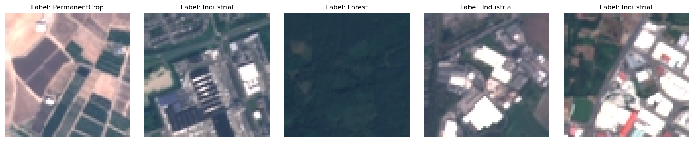
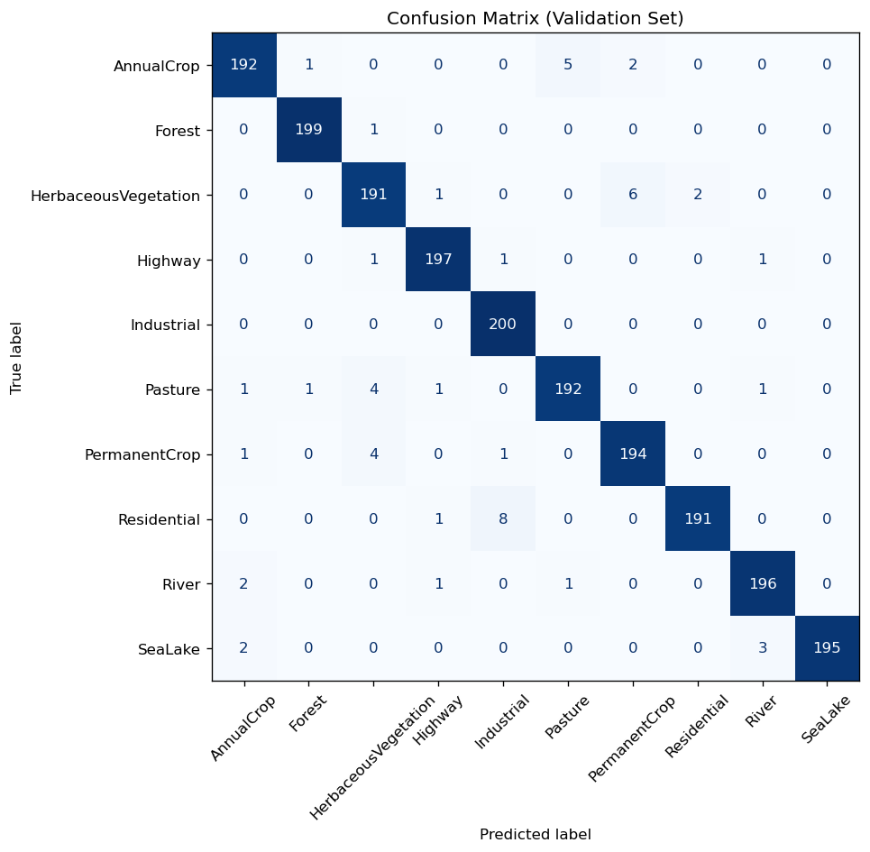
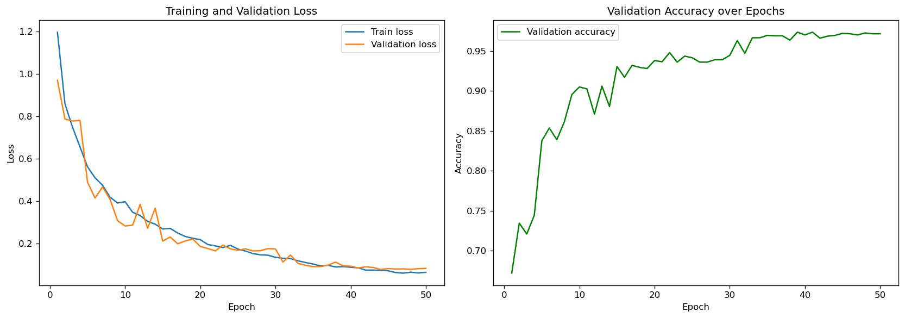
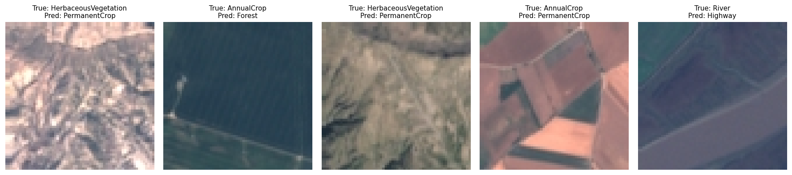

# 🛰️ Satellite Terrain Classification

**Turning raw satellite pixels into actionable land-use maps — a custom convolutional neural network that classifies Sentinel-2 imagery into ten terrain categories at 97.4% accuracy.**

[](https://www.python.org/)
[](https://pytorch.org/)
[](LICENSE)
[](#-results)

---

## Executive summary

Every day, Earth-observation satellites capture more imagery than any team of
human analysts could ever review by hand. Knowing *what is on the ground* —
forest, farmland, water, roads, or buildings — underpins decisions in climate
monitoring, agriculture, urban planning, disaster response, and environmental
protection. Doing this manually at planetary scale is impossible.

This project builds an automated **terrain classifier**: give it a small
satellite image patch, and it tells you which of ten land-use categories it
shows — in milliseconds. A convolutional neural network, designed and trained
**from scratch**, learns to recognise the visual fingerprints of each terrain
type directly from raw pixels, reaching **97.35% accuracy** on held-out data.

The result is a compact, fast, and accurate model that could slot into a larger
pipeline for mapping land cover, tracking deforestation or urban sprawl, or
flagging changes in agricultural land over time — the kind of insight that turns
a firehose of satellite data into something a decision-maker can act on.

An interactive web app is included: drop in an image, get an instant prediction
with per-class confidence.

---

## What it classifies

The model distinguishes ten terrain classes from the **EuroSAT** benchmark
(64×64 RGB patches derived from Sentinel-2 satellite imagery):

| 🌾 AnnualCrop | 🌲 Forest | 🌿 HerbaceousVegetation | 🛣️ Highway | 🏭 Industrial |
|:---:|:---:|:---:|:---:|:---:|
| **🐄 Pasture** | **🌳 PermanentCrop** | **🏘️ Residential** | **🌊 River** | **💧 SeaLake** |



---

## Technical overview

### Architecture

A compact **VGG-style CNN** built from scratch in PyTorch — no pretrained
weights, no transfer learning. Four convolutional blocks progressively distil a
64×64×3 input into a 4×4×256 feature map, which a two-layer classifier head maps
to ten class logits.

```
Input 64×64×3
  └─ Block 1:  [Conv3×3(32) → BN → ReLU] ×2 → MaxPool   →  32×32×32
  └─ Block 2:  [Conv3×3(64) → BN → ReLU] ×2 → MaxPool   →  16×16×64
  └─ Block 3:  [Conv3×3(128) → BN → ReLU] ×2 → MaxPool  →   8×8×128
  └─ Block 4:  [Conv3×3(256) → BN → ReLU] ×2 → MaxPool  →   4×4×256
  └─ Classifier:  Flatten → Dropout(0.5) → FC(512) → BN → ReLU
                  → Dropout(0.5) → FC(10)
```

- **~3.28M** trainable parameters
- **Batch normalization** after every convolution for stable, faster training
- **Dropout (0.5)** in the classifier head to curb overfitting
- Every design choice (depth, width, regularization) tuned for small 64×64 tiles

### Dataset & pre-processing

- **10 classes**, 1,000 labelled images each (10,000 total), plus a held-out set
  of 1,980 unlabelled images for inference.
- **Stratified 80/20 train/validation split** (seeded for reproducibility).
- Per-channel **normalization** using statistics computed on the training split.
- **Label-preserving augmentation** during training — horizontal/vertical flips,
  small rotations, and mild colour jitter. Satellite tiles have no canonical
  orientation, so these transforms expand the effective dataset for free without
  distorting semantics.

### Training pipeline (PyTorch)

- **Optimizer:** Adam (lr = 1e-3, weight decay = 1e-4)
- **LR schedule:** cosine annealing over the full run
- **Loss:** cross-entropy
- **Early stopping** on validation accuracy (patience = 12 epochs)
- **Best-checkpoint saving** — the highest-validation-accuracy model is persisted
- Images are decoded once and **cached in RAM** so CPU epochs stay fast
- Fully seeded (NumPy + PyTorch) for reproducible runs

---

## 📊 Results

The model reaches **97.35% validation accuracy** with strong, balanced
performance across all ten classes.

| Metric | Score |
|---|:---:|
| **Accuracy** | **0.9735** |
| **Macro F1** | **0.9735** |
| **Weighted F1** | **0.9735** |
| **Cohen's κ** | **0.9706** |

Macro-F1 tracking accuracy almost exactly confirms the model is *not* trading off
rare classes for common ones — it performs uniformly well across the board.

### Per-class precision / recall / F1 (validation set)

| Class | Precision | Recall | F1-score | Support |
|---|:---:|:---:|:---:|:---:|
| AnnualCrop           | 0.9697 | 0.9600 | 0.9648 | 200 |
| Forest               | 0.9900 | 0.9950 | 0.9925 | 200 |
| HerbaceousVegetation | 0.9502 | 0.9550 | 0.9526 | 200 |
| Highway              | 0.9801 | 0.9850 | 0.9825 | 200 |
| Industrial           | 0.9524 | 1.0000 | 0.9756 | 200 |
| Pasture              | 0.9697 | 0.9600 | 0.9648 | 200 |
| PermanentCrop        | 0.9604 | 0.9700 | 0.9652 | 200 |
| Residential          | 0.9896 | 0.9550 | 0.9720 | 200 |
| River                | 0.9751 | 0.9800 | 0.9776 | 200 |
| SeaLake              | 1.0000 | 0.9750 | 0.9873 | 200 |
| **Macro avg**        | **0.9737** | **0.9735** | **0.9735** | **2000** |

The hardest pairs are the visually similar vegetation classes
(*HerbaceousVegetation*, *AnnualCrop*, *PermanentCrop*) — exactly where one would
expect a model to struggle, since these terrains overlap even to the human eye.

### Confusion matrix



### Training dynamics

Loss and validation accuracy converge smoothly, with early stopping halting the
run once validation accuracy plateaus.



### Where it slips

A look at misclassified validation tiles — almost all are genuinely ambiguous,
falling between adjacent vegetation/crop categories.



> Full machine-readable metrics are saved to
> [`outputs/metrics.json`](outputs/metrics.json).

---

## 🚀 Installation

```bash
# 1. Clone
git clone <your-repo-url>
cd satellite-terrain-classification

# 2. Create an environment
python -m venv .venv
source .venv/bin/activate        # Windows: .venv\Scripts\activate

# 3. Install dependencies
pip install -r requirements.txt
```

The trained checkpoint (`models/best_model.pt`) and all evaluation artifacts are
included, so you can run inference and the web app **without retraining**. To
train from scratch or re-run evaluation, download the dataset as described in
[`data/README.md`](data/README.md).

---

## 🧑‍💻 Usage

All commands are run from the repository root. Configuration lives in
[`configs/default.yaml`](configs/default.yaml) — paths, hyperparameters, class
names, and normalization stats are all defined there.

**Launch the interactive web app** (upload a tile → get a prediction):

```bash
shiny run --reload app/app.py
```

**Run exploratory data analysis** (regenerates the EDA plots):

```bash
python -m src.eda
```

**Train the model:**

```bash
python -m src.train
```

**Evaluate** (metrics, confusion matrix, misclassified samples, and the test-set
`submission.csv`):

```bash
python -m src.evaluate
```

**Explore the full workflow end-to-end** in the notebook:

```bash
jupyter notebook notebooks/satellite_image_classification.ipynb
```

---

## 🗂️ Project structure

```
satellite-terrain-classification/
├── README.md
├── LICENSE                      # MIT
├── requirements.txt
├── .gitignore
├── configs/
│   └── default.yaml            # paths, hyperparameters, class names, norm stats
├── data/                       # dataset (not version-controlled — see data/README.md)
│   ├── README.md
│   ├── train/                  # one sub-folder per class
│   └── test/                   # flat folder of unlabelled images
├── notebooks/
│   └── satellite_image_classification.ipynb   # full annotated workflow
├── src/
│   ├── __init__.py
│   ├── config.py               # loads configs/default.yaml
│   ├── data.py                 # scanning, split, Dataset, transforms
│   ├── model.py                # SatelliteCNN architecture
│   ├── eda.py                  # exploratory data-analysis plots
│   ├── train.py                # training loop (checkpointing, early stopping)
│   └── evaluate.py             # metrics, plots, submission generation
├── app/
│   └── app.py                  # Shiny web app for interactive inference
├── models/
│   └── best_model.pt           # trained weights
└── outputs/
    ├── metrics.json            # full classification metrics
    ├── history.json            # per-epoch training history
    ├── submission.csv          # predictions on the test set
    └── plots/                  # EDA + evaluation figures
```

---

## 🔭 Future work

- **Transfer learning** — benchmark a fine-tuned ResNet/EfficientNet backbone
  against the from-scratch CNN to quantify the accuracy ceiling.
- **Multispectral input** — EuroSAT ships 13 spectral bands; the near-infrared
  and red-edge bands are highly informative for vegetation and water, and would
  likely lift the harder crop/vegetation classes.
- **Test-time augmentation & model ensembling** for a further accuracy bump.
- **Explainability** — Grad-CAM overlays to visualise which regions drive each
  prediction, building trust for real-world use.
- **Scaling up** — train on the full 27,000-image EuroSAT set and validate
  geographic generalisation across regions and seasons.
- **Deployment** — package the model behind a REST API (FastAPI) and containerise
  it (Docker) for batch or streaming inference at scale.
- **Tiling pipeline** — slide the classifier over large scenes to produce full
  land-cover segmentation maps rather than single-tile labels.

---

## 📜 License

Released under the [MIT License](LICENSE).

## Acknowledgements

Built on the **EuroSAT** dataset — Helber et al., *"EuroSAT: A Novel Dataset and
Deep Learning Benchmark for Land Use and Land Cover Classification"*,
IEEE JSTARS, 2019.
